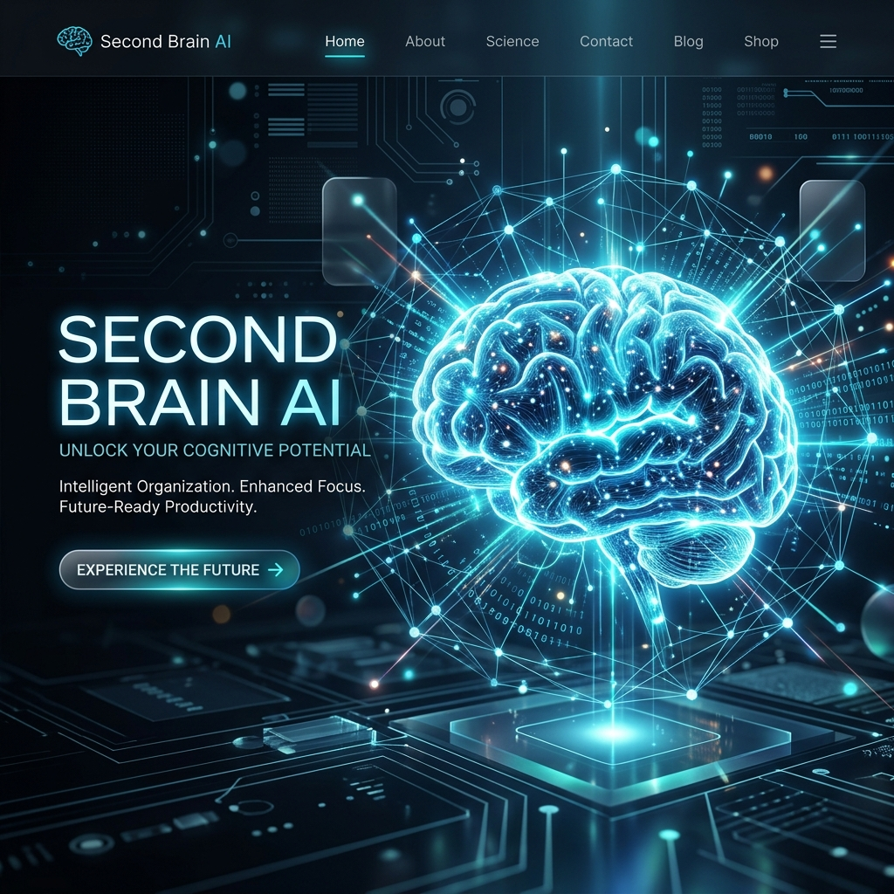
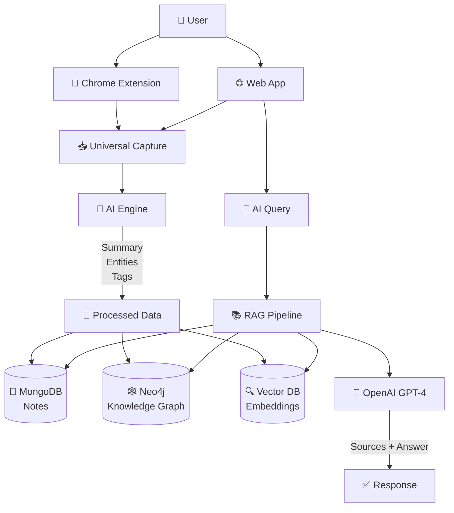

# Second Brain AI 🧠 

[](https://opensource.org/licenses/MIT)
[](https://nextjs.org/)
[](https://reactjs.org/)
[](https://nodejs.org/)
[](https://mongodb.com/)
[](https://github.com/)

**Your Personal AI-Powered Knowledge Intelligence System**  
*Notion + Obsidian + ChatGPT, but trained exclusively on YOUR data*

<div align="center">
  

  
</div>

## 🚀 Quick Demo

<div align="center">
  
  <br><br>
  <em>*(Live AI Intelligence Interface Preview)*</em>
</div>

## ✨ Core Features

| Feature | Status | Description |
| :--- | :--- | :--- |
| 🧠 **Universal Capture** | 🔄 MVP | Notes, PDFs, articles, YouTube (via Chrome Extension) |
| 🤖 **AI Processing** | ✅ Live | Auto-summaries, entity extraction, and smart tagging |
| 🌐 **Knowledge Graph** | 🔄 Beta | Visualizing connections between your ideas |
| 💬 **AI Chat** | ✅ Live | Contextual queries limited strictly to your private data |
| 🔍 **Semantic Search** | 🔄 Coming | Natural language search based on meaning, not just keywords |
| 📊 **Daily Insights** | 🔄 Coming | Personalized learning patterns and digest |

## 🎯 Product Vision
Second Brain AI is your external brain that:

- 📥 **Captures** everything you consume across the web.
- 🧠 **Organizes** data into a connected, searchable knowledge graph.
- 🤖 **Answers** your questions using ONLY your verified data.
- 💡 **Discovers** hidden connections and generates new insights.

**Real Examples:**
- *"What do I know about AI startups?"*
- *"Connect my React and TypeScript notes"*
- *"Summarize everything I've saved about productivity"*

## 🛠 Tech Stack

- **Frontend:** Next.js 14 + React 18 + Tailwind CSS  
- **Backend:** Node.js + Express.js  
- **Database:** MongoDB + Neo4j Graph DB  
- **AI/ML:** OpenAI GPT-4 + Embeddings (Pinecone)  
- **Storage:** AWS S3  
- **Extension:** Chrome Extension API  
- **Deployment:** Vercel + Railway  

## 📱 Quick Start

### Prerequisites
```bash
Node.js 18+          # nvm install 18
MongoDB 7.0+         # brew install mongodb-community
OpenAI API Key       # platform.openai.com/api-keys
```

### 🚀 3-Minute Setup
```bash
# Clone & Install
git clone https://github.com/hariom123-dev/Luminary-2nd-Brain-.git
cd luminary-2nd-brain

# Installation
npm install

# Setup Environment
cp .env.example .env
# Add your OPENAI_API_KEY and MONGODB_URI
```

### Local URLs
- **Main App:** `http://localhost:3000`

### Environment Variables
```env
OPENAI_API_KEY=sk-...
MONGODB_URI=mongodb://localhost:27017/secondbrain
NEXTAUTH_SECRET=your-super-secret-key
NEXTAUTH_URL=http://localhost:3000
```

## 🏗️ System Architecture


## 🎨 User Experience Flows

### 1. Lightning Save ✨ (15 seconds)
1. Install Chrome Extension.
2. Click **"Save to Brain"** on any web page.
3. AI processes the content automatically in the background.

### 2. Chat Your Knowledge 🗣️
1. Type: *"What do I know about React hooks?"*
2. AI scans **ONLY** your data.
3. Receive a concise answer with source citations and related connections.

### 3. Graph Exploration 🌐
1. Open the **Knowledge Graph** view.
2. Click the **"React"** node.
3. Discover related topics: *Hooks → State → Performance → Optimization*.

## 📊 Development Roadmap

| Phase | Features | Timeline | Status |
| :--- | :--- | :--- | :--- |
| **MVP v0.1** | Notes + AI Chat + RAG | 2 weeks | ✅ Complete |
| **v1.0** | Knowledge Graph + Chrome Ext | 4 weeks | 🔄 60% |
| **v1.1** | Semantic Search + Insights | Q1 2024 | 📅 Planned |
| **v2.0** | Mobile + Voice + Teams | Q2 2024 | 🔮 Future |

## 💎 What's Live Now (MVP)
- ✅ Note capture (Text + PDFs)
- ✅ AI summaries & entity extraction
- ✅ RAG Chat (Exclusive to your data)
- ✅ Source citations
- ✅ Responsive UI with Dark Mode
- ✅ User Authentication (NextAuth)

## 🔮 Planned Features
- [ ] Chrome Extension (1-click save)
- [ ] Full Knowledge Graph UI
- [ ] YouTube transcript processing
- [ ] Voice-to-text notes
- [ ] Mobile apps (React Native)
- [ ] Team collaboration
- [ ] Export to Obsidian/Markdown
- [ ] Self-hosting option

## ⚠️ Key Challenges Solved

| Challenge | Our Solution |
| :--- | :--- |
| **AI Costs** | Intelligent caching + batch processing pipelines |
| **Data Privacy** | 100% user-isolated data, strictly no model training on user info |
| **Graph Scale** | Neo4j + progressive loading for smooth visualization |
| **Query Speed** | Hybrid search (vector embeddings + graph traversal) |

## 🔐 Privacy & Security
- ✅ **YOUR** data stays **YOURS**.
- ✅ No global model training on private notes.
- ✅ E2E encryption (v2.0).
- ✅ Local-first architecture (optional).
- ✅ Full data export and account deletion.

## 💰 Business Model

| Plan | Storage | Queries | Features |
| :--- | :--- | :--- | :--- |
| **Free** | 100 notes | 10/day | Basic AI features |
| **Pro** ($9/mo) | Unlimited | Unlimited | GPT-4, Graph UI, Extension |
| **Teams** ($29/mo) | Unlimited | Unlimited | Shared knowledge bases |

## 🤝 Contributing
1. Fork the repo.
2. Clone locally.
3. Create a feature branch: `git checkout -b feat/amazing-feature`.
4. Commit your changes: `git commit -m 'feat: add amazing feature'`.
5. Push & Open a Pull Request.

## 📄 License
This project is licensed under the **MIT License** — use it for any purpose!

## 🙌 Acknowledgments
Built with ❤️ and these amazing tools:

<div align="center">
  
</div>

## 🚀 Get Involved
- ⭐ **Star** this repo if you find it useful!
- 🐛 **Bug?** Open an issue.
- 💡 **Idea?** Start a discussion.

<div align="center">
  <br>
  <strong>🧠 Second Brain AI</strong><br>
  Remember everything. Discover anything. Build your intelligence.
</div>

<div align="center" style="margin-top: 2rem; padding: 2rem; background: linear-gradient(45deg, #0a0a0a, #1a1a2e); border-radius: 1rem; color: white;">
  <p>"The best way to predict the future is to invent it."</p>
  <p>— Alan Kay</p>
</div>
